Logo de Mi Empresa		Logo de mi Cliente

**UNIVERSIDAD PRIVADA DE TACNA
FACULTAD DE INGENIERIA**

**Escuela Profesional de Ingeniería de Sistemas**

` `**Proyecto {*Casa de Cambio en Línea}***

Curso: {*Diseño de Arquitectura de Software}*

Docente: {*Patrick Cuadros}*

Integrantes:

***Chambi Cori, Jerson Roni                           (2021072619)***

***Luna Peña Edinson Oscar		         (2020066320)***

***Flores Quispe, Jaime Elias                          (2021070309)***

***Leyva Sardon, Elvis Ronald                        (2021072614)***

**Tacna – Perú**

***{2024}***

|CONTROL DE VERSIONES||||||
| :-: | :- | :- | :- | :- | :- |
|Versión|Hecha por|Revisada por|Aprobada por|Fecha|Motivo|
|1\.0|MPV|ELV|ARV|10/10/2020|Versión Original|

**Sistema *{Casa de Cambio en Línea}***

**Documento de Especificación de Requerimientos de Software**

**Versión *{1.0}***

|CONTROL DE VERSIONES||||||
| :-: | :- | :- | :- | :- | :- |
|Versión|Hecha por|Revisada por|Aprobada por|Fecha|Motivo|
|1\.0|MPV|ELV|ARV|10/10/2020|Versión Original|

**INDICE GENERAL**

[INTRODUCCION	](#_30j0zll)4

[I. Generalidades de la Empresa	](#_1fob9te)5

`	`1. Nombre de la Empresa	5

`	`2. Vision	5

`	`3. Mision	5

`	`4. Organigrama	5

[II. Visionamiento de la Empresa	](#_1fob9te)5

`	`1. Descripcion del Problema	5

`	`2. Objetivos de Negocios	5

`	`3. Objetivos de Diseño	5

`	`4. Alcance del proyecto	5

`	`5. Viabilidad del Sistema	5

`	`6. Informacion obtenida del Levantamiento de Informacion	6

[III.  Análisis de Procesos	](#_1fob9te)6

`	`a) Diagrama del Proceso Actual – Diagrama de actividades	6

`	`b) Diagrama del Proceso Propuesto – Diagrama de actividades Inicial	7

[IV Especificacion de Requerimientos de Software	](#_1fob9te)7

`	`a) Cuadro de Requerimientos funcionales Inicial	7

`	`b) Cuadro de Requerimientos No funcionales	7

`	`c) Cuadro de Requerimientos funcionales Final	8

`	`d) Reglas de Negocio	9

[V Fase de Desarrollo	](#_1fob9te)12

`	`1. Perfiles de Usuario	12

`	`2. Modelo Conceptual	5

`	`a) Diagrama de Paquetes	5

`	`b) Diagrama de Casos de Uso	12

`	`c) Escenarios de Caso de Uso (narrativa)	14

[    3. Modelo Logico	](#_1fob9te)23

`	`a) Analisis de Objetos	23

`	`b) Diagrama de Actividades con objetos	32

`	`c) Diagrama de Secuencia	37

`	`d) Diagrama de Clases	42

[CONCLUSIONES	](#_2et92p0)46

[RECOMENDACIONES	](#_tyjcwt)46

[BIBLIOGRAFIA	](#_3dy6vkm)46

[WEBGRAFIA	](#_1t3h5sf)46

**I. Generalidades de la Empresa** 

1. **Nombre de la Empresa** 

   Sistema “Casa de Cambio en Linea”

1. **Visión** 

   Aspiramos a liderar el mercado de cambio de divisas en línea, proporcionando una plataforma digital innovadora y confiable que simplifique y mejore la experiencia de nuestros clientes al cambiar monedas. Nos esforzamos por ser reconocidos como la opción preferida para quienes buscan realizar cambios de moneda, garantizando transparencia, eficiencia y satisfacción en cada transacción.

1. **Misión**

   En nuestra Casa de Cambio en Línea, nos dedicamos a proporcionar un servicio de cambio de divisas confiable y accesible a través de una plataforma digital innovadora. Nuestra misión es facilitar transacciones financieras internacionales de manera segura y eficiente, asegurando la satisfacción de nuestros clientes al ofrecer tasas competitivas, transparencia absoluta y un servicio al cliente excepcional. Nos comprometemos a utilizar tecnología de vanguardia para garantizar la protección de los datos personales y financieros de nuestros usuarios, promoviendo así la conveniencia y la confianza en cada operación de cambio de moneda que realizamos.

1. **Organigrama**

**II. Visionamiento de la empresa** 

1. **Descripción del Problema** 

   En el contexto del cambio de divisas en línea, los usuarios enfrentan diversos desafíos al buscar un servicio confiable y eficiente. A menudo encuentran dificultades para obtener tasas de cambio competitivas y para realizar transacciones de manera segura. Además, pueden experimentar frustración debido a la falta de transparencia y claridad en el proceso de cambio de moneda. Esta complejidad puede generar incertidumbre y dificultades en la experiencia del usuario, impactando negativamente en su confianza y satisfacción al utilizar servicios de cambio de divisas en línea.

1. **Objetivos de Negocios** 
- Facilitar el intercambio de divisas de manera segura y eficiente para nuestros usuarios. 
- Mejorar la accesibilidad y transparencia en el proceso de cambio de divisas. 
- Fomentar relaciones sólidas y confiables con nuestros clientes. 
- Establecer una plataforma digital líder en el mercado de cambio de divisas en línea.

1. **Objetivos de Diseño**
- Desarrollar una plataforma digital intuitiva y amigable para los usuarios.
- ` `Garantizar la seguridad y confidencialidad de la información financiera y personal de nuestros clientes. 
- Implementar herramientas avanzadas de búsqueda y filtros personalizados para mejorar la experiencia del usuario al buscar y comparar tasas de cambio. 
- Facilitar la comunicación directa y transparente entre nuestra casa de cambio y nuestros clientes. 
- Proporcionar herramientas de gestión eficientes y transparentes para facilitar las transacciones de cambio de divisas.

1. **Alcance del Proyecto** 

   El proyecto de nuestra Casa de Cambio en Línea se centrará en desarrollar e implementar una plataforma digital integral para facilitar el cambio de divisas. Esto incluirá la creación de perfiles de usuarios, funcionalidades avanzadas de búsqueda de tasas de cambio, herramientas de comunicación directa con los clientes, gestión de transacciones de cambio de divisas, y un sistema de seguridad robusto para proteger la información financiera y personal de los usuarios.

1. **Viabilidad del Sistema**

   Nuestra Casa de Cambio en Línea demostrará su viabilidad técnica mediante el uso de tecnologías avanzadas y robustas para desarrollar la plataforma, asegurando su funcionalidad y estabilidad. La viabilidad económica será evaluada a través de un análisis detallado de coste-beneficio, garantizando un retorno positivo de la inversión mediante la eficiencia operativa y la satisfacción del cliente.

1. **Información obtenida del levantamiento de información**

   El levantamiento de información ha proporcionado datos esenciales sobre las necesidades y preferencias de los usuarios en el mercado de cambio de divisas en línea. Se ha recopilado información detallada sobre los desafíos actuales enfrentados por los usuarios, así como sugerencias y expectativas para mejorar la experiencia de cambio de divisas. Este conocimiento será fundamental para diseñar y desarrollar nuestra plataforma de Casa de Cambio en Línea, asegurando que satisfaga las demandas del mercado y supere las expectativas de nuestros usuarios.

[III.  Análisis de Procesos	](#_1fob9te)6

`	`[a) Diagrama del Proceso Actual – Diagrama de actividades](#_3znysh7)

`	`[b) Diagrama del Proceso Propuesto – Diagrama de actividades Inicial](#_3znysh7)

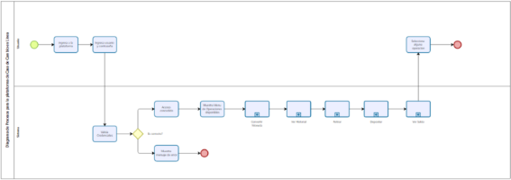

Sub procesos:

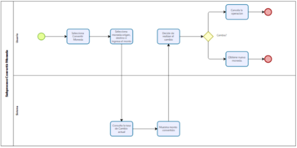

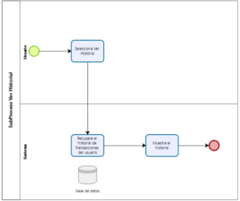

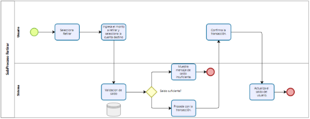

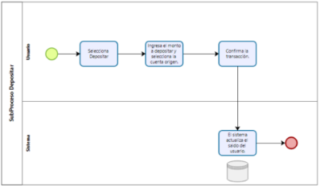

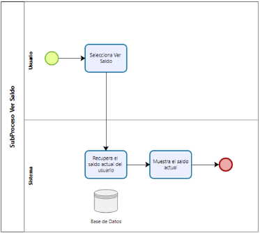

[IV Especificacion de Requerimientos de Software	](#_1fob9te)

`	`[a) Cuadro de Requerimientos funcionales Inicial](#_3znysh7)

|**ID**|**Requerimiento Funcional**|**Descripción**|
| - | - | - |
|RF1|Registro de Usuarios|
Permitir a los usuarios registrarse con un perfil personal.

Validar la información del usuario durante el registro.
|
|RF2|Consulta de Tasas de Cambio|
Mostrar las tasas de cambio actuales entre las monedas disponibles.

Actualizar las tasas de cambio periódicamente.
|
|RF3|Calculadora de Conversión|
Permitir a los usuarios ingresar una cantidad en una moneda y convertirla a otra moneda seleccionada.

Mostrar el resultado de la conversión de manera clara y precisa.
|
|RF4|Comunicación entre Usuarios|Los propietarios e inquilinos deben poder comunicarse entre sí a través de la plataforma para discutir detalles y coordinar el proceso de alquiler.|
|RF5|Mantener un registro del historial de transacciones para cada usuario|
Mostrar detalles como la cantidad convertida, la tasa aplicada, el monto recibido, la fecha y hora de la transacción, entre otros.

|
|RF6|Métodos de Pago|Integrar métodos de pago seguros para realizar las transacciones (por ejemplo, tarjetas de crédito, PayPal, transferencias bancarias, etc.)|

`	`[b) Cuadro de Requerimientos No funcionales](#_3znysh7)

|**ID**|**Requerimiento No Funcional**|**Descripción**|
| - | - | - |
|RNF1|Usabilidad|La plataforma debe ser fácil de usar y navegar, con una interfaz intuitiva que permita a los usuarios encontrar rápidamente la información que necesitan y realizar acciones sin dificultad.|
|RNF2|Rendimiento|La plataforma debe ser rápida y eficiente, con tiempos de carga cortos y respuesta inmediata a las acciones del usuario, incluso en momentos de alta demanda.|
|RNF3|Disponibilidad|La plataforma debe estar disponible las 24 horas del día, los 7 días de la semana, con un tiempo de inactividad mínimo planificado para mantenimiento y actualizaciones.|
|RNF4|Seguridad|Se deben implementar medidas de seguridad robustas para proteger la información personal y financiera de los usuarios, incluyendo encriptación de datos, autenticación de dos factores y protección contra ataques cibernéticos.|
|RNF5|Escalabilidad|La plataforma debe ser capaz de manejar un alto volumen de usuarios y alojamientos, con la capacidad de escalar vertical u horizontalmente según sea necesario para satisfacer la demanda.|
|RNF6|Adaptabilidad|La plataforma debe ser adaptable a diferentes dispositivos y tamaños de pantalla, incluyendo computadoras de escritorio, tabletas y dispositivos móviles, garantizando una experiencia consistente en todas las plataformas.|
|RNF7|Cumplimiento Legal|La plataforma debe cumplir con todas las leyes y regulaciones aplicables en materia de protección de datos, privacidad del usuario, derechos de autor y cualquier otra normativa relevante en las jurisdicciones en las que opera.|

`	`[c) Cuadro de Requerimientos funcionales Final](#_3znysh7)

|**ID**|**Requerimiento Funcional**|**Descripción**|
| - | - | - |
|RF1|Registro de Usuario|Los usuarios deben poder registrarse en la plataforma proporcionando información básica como nombre, dirección de correo electrónico y contraseña.|
|RF2|Autenticación de Usuario|Los usuarios registrados deben poder iniciar sesión en sus cuentas utilizando un nombre de usuario y contraseña seguros.|
|RF3|Consulta de Tasas de Cambio|Los usuarios deben poder consultar las tasas de cambio actualizadas entre diferentes pares de divisas.|
|RF4|Realización de Transacciones|Los usuarios deben poder realizar transacciones de cambio de divisas de manera segura y eficiente, eligiendo entre diferentes métodos de pago aceptados.|
|RF5|Historial de Transacciones|Los usuarios deben tener acceso a un historial detallado de todas las transacciones de cambio de divisas realizadas en la plataforma.|
|RF6|Notificaciones y Alertas|La plataforma debe ser capaz de enviar notificaciones y alertas relevantes a los usuarios, como confirmaciones de transacciones y cambios en las tasas de cambio.|
|RF7|Soporte al Cliente|Debe existir un sistema de soporte al cliente accesible para ayudar a los usuarios con consultas, problemas técnicos o cualquier otro tipo de asistencia relacionada con las transacciones de cambio de divisas.|

[3. Modelo Logico	](#_1fob9te)

`	`

	[c) Diagrama de Secuencia](#_3znysh7)

Diagrama de Secuencia para Gestionar Usuarios

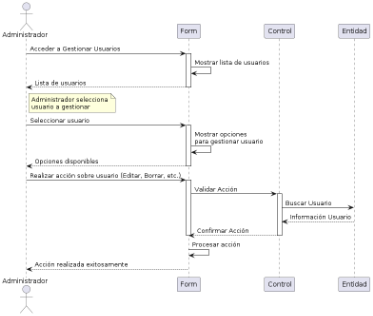

Diagrama de Secuencia para Gestionar Monedas

Diagrama de Secuencia para Gestionar Tasas de Cambio

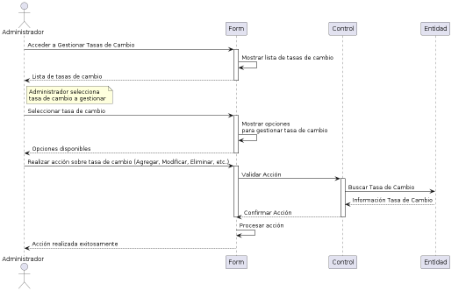

Diagrama de Secuencia para Cliente realizando una conversión

Diagrama de Secuencia: Cliente Realizando un Retiro

Diagrama de Secuencia: Cliente Consultando su Historial de Transacciones

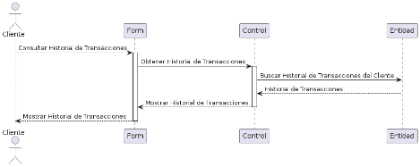

Diagrama de Secuencia: Cliente Consultando Saldo

Diagrama de Secuencia: Cliente Realizando un Depósito

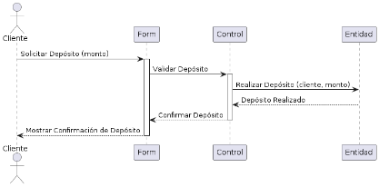

Diagrama de Secuencia: Administrador actualiza Tasa de Cambio

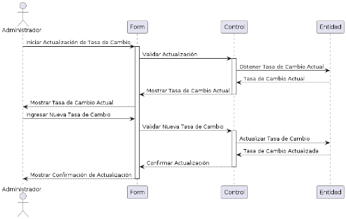

`	`[d) Diagrama de Clases](#_3znysh7)

[CONCLUSIONES](#_2et92p0)

- **Cumplimiento de Objetivos**: La plataforma de Casa de Cambio en Línea cumple con los objetivos de negocio y de diseño planteados, proporcionando una herramienta digital segura, eficiente y fácil de usar para el cambio de divisas.

- **Mejora de la Experiencia del Usuario**: El sistema desarrollado mejora significativamente la experiencia del usuario en comparación con los servicios tradicionales de cambio de divisas. La integración de herramientas avanzadas y la facilidad de uso contribuyen a una mayor satisfacción del cliente.

- **Seguridad y Confianza**: Se han implementado robustas medidas de seguridad, como la encriptación de datos y la autenticación de dos factores, que garantizan la protección de la información financiera y personal de los usuarios, promoviendo la confianza en la plataforma.

- **Transparencia y Eficiencia**: La plataforma ofrece transparencia en las tasas de cambio y eficiencia en la realización de transacciones, lo que facilita la toma de decisiones informadas por parte de los usuarios y agiliza el proceso de cambio de divisas.

- **Viabilidad Técnica y Económica**: La viabilidad técnica ha sido confirmada mediante el uso de tecnologías avanzadas, mientras que la viabilidad económica ha sido evaluada positivamente a través de un análisis coste-beneficio, asegurando un retorno de inversión favorable.

[RECOMENDACIONES](#_tyjcwt)

- **Monitoreo y Actualización Continua**: Es esencial establecer un sistema de monitoreo continuo de la plataforma para identificar y resolver problemas rápidamente. Las actualizaciones periódicas asegurarán que la plataforma se mantenga actualizada con las últimas tecnologías y tendencias del mercado.
- **Expansión de Funcionalidades**: Considerar la incorporación de nuevas funcionalidades, como la integración con más métodos de pago y la implementación de herramientas de análisis financiero, para proporcionar un valor añadido a los usuarios.
- **Capacitación y Soporte al Cliente**: Implementar programas de capacitación para los usuarios y un sistema de soporte al cliente eficiente para ayudar a resolver dudas y problemas, mejorando así la experiencia del usuario y fomentando la fidelidad del cliente.
- **Estrategias de Marketing**: Desarrollar estrategias de marketing efectivas para promover la plataforma y atraer a un mayor número de usuarios. Esto incluye la utilización de medios digitales y redes sociales para aumentar la visibilidad y el alcance del servicio.
- **Adaptación a Normativas y Regulaciones**: Asegurarse de que la plataforma cumpla con todas las normativas y regulaciones locales e internacionales relacionadas con el cambio de divisas y la protección de datos, evitando así problemas legales y construyendo confianza con los usuarios.
- **Escalabilidad del Sistema**: Planificar la escalabilidad del sistema para manejar un mayor volumen de usuarios y transacciones en el futuro, asegurando que la plataforma pueda crecer y adaptarse según las necesidades del mercado.

