Logo de Mi Empresa		Logo de mi Cliente

**UNIVERSIDAD PRIVADA DE TACNA
FACULTAD DE INGENIERÍA**

**Escuela Profesional de Ingeniería de Sistemas**

 **Proyecto *Casa de Cambio en Línea***

Curso: *Diseño de Arquitectura de Software*

Docente: *Patrick Cuadros*

Integrantes:

***Chambi Cori, Jerson Roni                           (2021072619)***

***Luna Peña Edinson Oscar		         (2020066320)***

***Flores Quispe, Jaime Elias                          (2021070309)***

***Leyva Sardon, Elvis Ronald                        (2021072614)***

**Tacna – Perú**

***2024***

|CONTROL DE VERSIONES||||||
| :-: | :- | :- | :- | :- | :- |
|Versión|Hecha por|Revisada por|Aprobada por|Fecha|Motivo|
|1\.0||||06/24/2024|Versión Original|

**Sistema *{Casa de Cambio en Línea}***

**Documento de Arquitectura de Software**

**Versión *{1.0}***

|CONTROL DE VERSIONES||||||
| :-: | :- | :- | :- | :- | :- |
|Versión|Hecha por|Revisada por|Aprobada por|Fecha|Motivo|
|1\.0|MPV|ELV|ARV|10/10/2020|Versión Original|

ÍNDICE GENERAL

**Contenido**

[***1.***](#_1fob9te)***INTRODUCCIÓN	5******

[**1.1.**](#_3znysh7)**Propósito (Diagrama 4+1)	5**

[**1.2.**](#_4d34og8)**Alcance	5**

[**1.3.**](#_17dp8vu)**Definición, siglas y abreviaturas	5**

[**1.4.**](#_lnxbz9)**Organización del documento	5**

[***2.***](#_3j2qqm3)***OBJETIVOS Y RESTRICCIONES ARQUITECTONICAS	5***

[2.1.1.](#_1y810tw)Requerimientos Funcionales	5

[2.1.2.](#_4i7ojhp)Requerimientos No Funcionales – Atributos de Calidad	5

[***3.***](#_3as4poj)***REPRESENTACIÓN DE LA ARQUITECTURA DEL SISTEMA	6***

[**3.1.**](#_49x2ik5)**Vista de Caso de uso	6**

[3.1.1.](#_2p2csry)Diagramas de Casos de uso	6

[**3.2.**](#_147n2zr)**Vista Lógica	6**

[3.2.1.](#_23ckvvd)Diagrama de Subsistemas (paquetes)	7

[3.2.2.](#_ihv636)Diagrama de Secuencia (vista de diseño)	7

[3.2.3.](#_111kx3o)Diagrama de Colaboración (vista de diseño)	7

[3.2.4.](#_32hioqz)Diagrama de Objetos	7

[3.2.5.](#_1hmsyys)Diagrama de Clases	7

[3.2.6.](#_41mghml)Diagrama de Base de datos (relacional o no relacional)	7

[**3.3.**](#_2grqrue)**Vista de Implementación (vista de desarrollo)	7**

[3.3.1.](#_3l18frh)Diagrama de arquitectura software (paquetes)	7

[3.3.2.](#_4f1mdlm)Diagrama de arquitectura del sistema (Diagrama de componentes)	7

[**3.4.**](#_206ipza)**Vista de procesos	7**

[3.4.1.](#_4k668n3)Diagrama de Procesos del sistema (diagrama de actividad)	8

[**3.5.**](#_2u6wntf)**Vista de Despliegue (vista física)	8**

[3.5.1.](#_19c6y18)Diagrama de despliegue	8

[***4.***](#_3tbugp1)***ATRIBUTOS DE CALIDAD DEL SOFTWARE	8***

[**Escenario de Funcionalidad	8**](#_2zbgiuw)

[**Escenario de Usabilidad	8**](#_1egqt2p)

[**Escenario de confiabilidad	9**](#_3ygebqi)

[**Escenario de rendimiento	9**](#_2dlolyb)

[**Escenario de mantenibilidad	9**](#_sqyw64)

[**Otros Escenarios	9**](#_3cqmetx)

1. INTRODUCCIÓN
   1. Propósito (Diagrama 4+1)
-  **Vista Lógica (Diagrama de Clases):**
  - Representar la estructura conceptual de la plataforma de cambio de divisas en línea.
  - Mostrar las clases principales del sistema y sus relaciones para entender cómo se organizan los datos y las funcionalidades del sistema.
  - Ejemplo: Clases como Usuario, Transacción, Método de Pago, etc.
- **Vista de Procesos (Diagrama de Secuencia):**
  - Detallar la interacción entre los actores y el sistema durante     procesos clave, como el registro de usuarios, consulta de tasas de cambio, y realización de transacciones.
  - Clarificar el flujo de actividades y las comunicaciones entre componentes del sistema.
  - Ejemplo: Secuencias de interacción entre Usuario y Sistema para realizar una transacción.
- **Vista Física (Diagrama de Despliegue):**
  - Describir cómo se distribuyen los componentes físicos o lógicos del sistema en el entorno de despliegue.
  - Indicar cómo se conectan los servidores, bases de datos y otros elementos tecnológicos para soportar la plataforma.
  - Ejemplo: Despliegue de la aplicación web en servidores de nube con bases de datos distribuidas.
- **Vista de Escenarios (Casos de Uso):**
  - Identificar los diferentes roles de usuarios y sus interacciones con el sistema a través de casos de uso detallados.
  - Mostrar cómo los usuarios utilizan la plataforma para realizar acciones específicas como registrarse, consultar tasas de cambio, y realizar transacciones.
  - Ejemplo: Casos de uso para Usuario Registrado, Administrador del Sistema, y Soporte al Cliente.
- **Vista de Diseño (Diagrama de Componentes):**
  - Representar los componentes físicos y lógicos del sistema y cómo se relacionan para cumplir con los requisitos funcionales y no funcionales.
  - Mostrar la estructura interna del sistema, incluyendo módulos, servicios y APIs utilizadas.
  - Ejemplo: Componentes como Interfaz de Usuario, Servicios de Seguridad, y Servidores de Aplicaciones.

Por ende estos diagramas proporcionan una visión integral y detallada del sistema de Casa de Cambio en Línea, facilitando la comprensión y comunicación entre desarrolladores, arquitectos y otros stakeholders involucrados en el proyecto.

1. Alcance

El informe se centrará en proporcionar una visión integral y detallada del sistema de Casa de Cambio en Línea, abordando los siguientes aspectos clave:

- **Descripción General del Proyecto:**
  - Introducción detallada al sistema "Casa de Cambio en Línea", incluyendo su propósito, objetivos y beneficios esperados tanto para usuarios como para la empresa.
- **Visión y Misión:**
  - Presentación de la visión y misión del proyecto, destacando el objetivo de liderar el mercado de cambio de divisas en línea mediante una plataforma segura, transparente y fácil de usar.
- **Análisis del Contexto y Problemas a Resolver:**
  - Análisis de los desafíos actuales en el mercado de cambio de divisas en línea, destacando las dificultades enfrentadas por los usuarios y la falta de transparencia en los servicios existentes.
- **Objetivos del Negocio y Diseño:**
  - Explicación detallada de los objetivos del negocio, que incluyen facilitar el intercambio de divisas de manera segura y eficiente, mejorar la accesibilidad y transparencia, y fomentar relaciones sólidas con los clientes.
  - Descripción de los objetivos de diseño, enfocados en desarrollar una plataforma intuitiva y segura que garantice la confidencialidad de la información financiera y personal de los usuarios.
- **Especificación de Requerimientos de Software:**
  - Cuadro detallado de los requisitos funcionales y no funcionales del sistema, incluyendo desde el registro de usuarios hasta la gestión de transacciones y la seguridad de la plataforma.
  - Identificación y explicación de los requisitos clave como la autenticación de usuarios, consulta de tasas de cambio, realización de transacciones y soporte al cliente.
- **Diagrama 4+1:**
  - Propósito y detalle de los diagramas 4+1 utilizados en el informe, explicando cómo cada vista (lógica, de procesos, física, de escenarios y de diseño) contribuye a la comprensión global del sistema de Casa de Cambio en Línea.
  - Ejemplos específicos de cada tipo de diagrama aplicados al contexto del proyecto.
- **Viabilidad del Sistema:**
  - Evaluación de la viabilidad técnica y económica del proyecto, demostrando cómo se utilizarán tecnologías avanzadas para garantizar la funcionalidad y estabilidad del sistema, así como asegurar un retorno positivo de la inversión.
- **Levantamiento de Información y Conclusión:**
  - Resumen de los datos esenciales obtenidos durante el levantamiento de información, destacando las necesidades y preferencias del mercado.
  - Conclusión que sintetice los hallazgos clave y proponga recomendaciones para el desarrollo futuro del sistema de Casa de Cambio en Línea.

Es así que alcance asegura que el informe sea completo, detallado y orientado a proporcionar una comprensión clara y profunda del proyecto de Casa de Cambio en Línea, abordando tanto los aspectos técnicos como estratégicos necesarios para su éxito.

1. Definición, siglas y abreviaturas

**RF**: Requerimiento Funcional

**RNF**: Requerimiento No Funcional

**API**: Interfaz de Programación de Aplicaciones

**BD**: Base de Datos

**UI**: Interfaz de Usuario (User Interface)

**CPU**: Unidad Central de Procesamiento (Central Processing Unit)

**RAM**: Memoria de Acceso Aleatorio (Random Access Memory)

**HTTPS**: Protocolo seguro de transferencia de hipertexto (Hypertext Transfer Protocol Secure)

**URL**: Localizador Uniforme de Recursos (Uniform Resource Locator)

**DNS**: Sistema de Nombres de Dominio (Domain Name System)

**HTML**: Lenguaje de Marcado de Hipertexto (Hypertext Markup Language)

**CSS**: Hojas de Estilo en Cascada (Cascading Style Sheets)

**SSL/TLS**: Capa de sockets seguros / Protocolo de Seguridad de la Capa de Transporte (Secure Sockets Layer / Transport Layer Security)

**VPN**: Red Privada Virtual (Virtual Private Network)

**API REST**: Interfaz de Programación de Aplicaciones Representacional (Representational State Transfer)

**JSON**: Notación de Objetos JavaScript (JavaScript Object Notation)

**XML**: Lenguaje de Marcado Extensible (eXtensible Markup Language)

1. Organización del documento

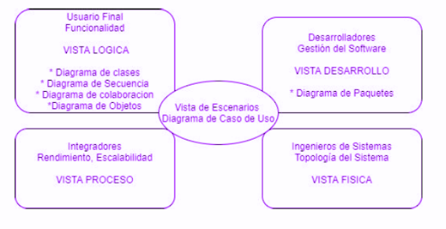

1. # **OBJETIVOS Y RESTRICCIONES ARQUITECTÓNICAS**
   [Establezca las prioridades de los requerimientos y las restricciones del proyecto)

   1. Priorización de requerimientos
      1. ### Requerimientos Funcionales

|**ID**|**Requerimiento Funcional**|**Descripción**|**Prioridad**|
| - | - | - | - |
|RF1|Registro de Usuario|Los usuarios deben poder registrarse en la plataforma proporcionando información básica como nombre, dirección de correo electrónico y contraseña.|Alta|
|RF2|Autenticación de Usuario|Los usuarios registrados deben poder iniciar sesión en sus cuentas utilizando un nombre de usuario y contraseña seguros.|Alta|
|RF3|Consulta de Tasas de Cambio|Los usuarios deben poder consultar las tasas de cambio actualizadas entre diferentes pares de divisas.|Alta|
|RF4|Realización de Transacciones|Los usuarios deben poder realizar transacciones de cambio de divisas de manera segura y eficiente, eligiendo entre diferentes métodos de pago aceptados.|Alta|
|RF5|Historial de Transacciones|Los usuarios deben tener acceso a un historial detallado de todas las transacciones de cambio de divisas realizadas en la plataforma.|Alta|
|RF6|Notificaciones y Alertas|La plataforma debe ser capaz de enviar notificaciones y alertas relevantes a los usuarios, como confirmaciones de transacciones y cambios en las tasas de cambio.|Medio|
|RF7|Soporte al Cliente|Debe existir un sistema de soporte al cliente accesible para ayudar a los usuarios con consultas, problemas técnicos o cualquier otro tipo de asistencia relacionada con las transacciones de cambio de divisas.|Bajo|

1. ### Requerimientos No Funcionales – Atributos de Calidad

|**ID**|**Requerimiento No Funcional**|**Descripción**|**Prioridad**|
| :-: | :-: | :-: | :-: |
|RNF1|Usabilidad|La plataforma debe ser fácil de usar y navegar, con una interfaz intuitiva que permita a los usuarios encontrar rápidamente la información que necesitan y realizar acciones sin dificultad.|Alta|
|RNF2|Rendimiento|La plataforma debe ser rápida y eficiente, con tiempos de carga cortos y respuesta inmediata a las acciones del usuario, incluso en momentos de alta demanda.|Alta|
|RNF3|Disponibilidad|La plataforma debe estar disponible las 24 horas del día, los 7 días de la semana, con un tiempo de inactividad mínimo planificado para mantenimiento y actualizaciones.|Alta|
|RNF4|Seguridad|Se deben implementar medidas de seguridad robustas para proteger la información personal y financiera de los usuarios, incluyendo encriptación de datos, autenticación de dos factores y protección contra ataques cibernéticos.|Alta|
|RNF5|Escalabilidad|La plataforma debe ser capaz de manejar un alto volumen de usuarios y alojamientos, con la capacidad de escalar vertical u horizontalmente según sea necesario para satisfacer la demanda.|Medio|
|RNF6|Adaptabilidad|La plataforma debe ser adaptable a diferentes dispositivos y tamaños de pantalla, incluyendo computadoras de escritorio, tabletas y dispositivos móviles, garantizando una experiencia consistente en todas las plataformas.|Alta|
|RNF7|Cumplimiento Legal|La plataforma debe cumplir con todas las leyes y regulaciones aplicables en materia de protección de datos, privacidad del usuario, derechos de autor y cualquier otra normativa relevante en las jurisdicciones en las que opera.|Medio|

1. Restricciones
#### ***1. Restricciones Técnicas***
- ***Tecnologías Específicas**: El sistema debe desarrollarse utilizando tecnologías específicas como Java para el backend, Angular para el frontend y MySQL como base de datos.*
- ***Compatibilidad de Navegadores**: La plataforma debe ser compatible con los navegadores más utilizados como Chrome, Firefox, Safari y Edge.*
- ***Integración de APIs**: Se deben integrar APIs externas para obtener tasas de cambio actualizadas en tiempo real.*
- ***Seguridad**: Uso obligatorio de SSL/TLS para garantizar comunicaciones seguras entre el cliente y el servidor.*
- ***Escalabilidad**: El sistema debe estar diseñado para escalar horizontalmente para soportar un aumento en el número de usuarios y transacciones.*
#### ***2. Restricciones de Desarrollo***
- ***Plazo de Entrega**: El desarrollo del sistema debe completarse en un plazo de 6 meses desde el inicio del proyecto.*
- ***Presupuesto**: El presupuesto total asignado para el desarrollo del sistema no debe exceder los 100,000 euros.*
- ***Recursos Humanos**: El equipo de desarrollo estará compuesto por un máximo de 5 desarrolladores, 1 arquitecto de software, y 2 testers.*
#### ***3. Restricciones Legales y de Cumplimiento***
- ***Regulaciones Financieras**: El sistema debe cumplir con todas las regulaciones financieras aplicables en los países donde operará, incluyendo normativas de anti-lavado de dinero (AML) y Conozca a su Cliente (KYC).*
- ***Protección de Datos**: Cumplimiento obligatorio con el Reglamento General de Protección de Datos (GDPR) de la UE para proteger la información personal de los usuarios.*
- ***Auditorías**: La plataforma debe permitir la realización de auditorías periódicas por entidades reguladoras.*
#### ***4. Restricciones de Operación***
- ***Disponibilidad**: El sistema debe garantizar una disponibilidad mínima del 99.9%, con un tiempo máximo de inactividad de 8.76 horas al año.*
- ***Soporte Técnico**: Se debe proporcionar soporte técnico a los usuarios durante el horario comercial estándar.*
- ***Backup y Recuperación**: Implementación de un sistema de backup y recuperación de datos que permita la restauración completa en un máximo de 4 horas en caso de fallo.*
#### ***5. Restricciones de Usabilidad***
- ***Interfaz de Usuario**: La interfaz de usuario debe ser intuitiva y accesible, cumpliendo con las directrices de accesibilidad WCAG 2.1.*
- ***Multilenguaje**: La plataforma debe estar disponible al menos en español e inglés.*
1. # **REPRESENTACIÓN DE LA ARQUITECTURA DEL SISTEMA**
   1. Vista de Caso de uso

1. ### Diagramas de Casos de uso
   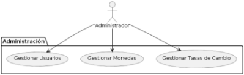

   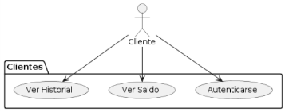

   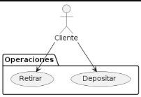

   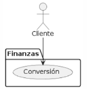

1. Vista Lógica
###
1. ### Diagrama de Subsistemas (paquetes)

   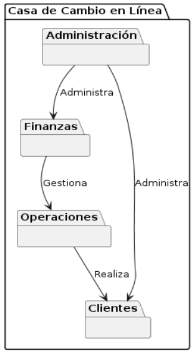

   Administración --> Finanzas: Indica que el paquete de Administración administra el paquete de Finanzas. Esto implica que desde la Administración se gestionan aspectos relacionados con las operaciones financieras como la conversión de monedas.

   Administración --> Clientes: Indica que el paquete de Administración administra el paquete de Clientes. Esto significa que desde Administración se gestionan aspectos relacionados con los clientes, como la gestión de cuentas y transacciones.

   Finanzas --> Operaciones: Indica que el paquete de Finanzas gestiona el paquete de Operaciones. Esto implica que las operaciones financieras, como la conversión de monedas, pueden afectar o ser gestionadas a través de las operaciones de retirar y depositar fondos.

   Operaciones --> Clientes: Indica que el paquete de Operaciones realiza acciones que afectan a los clientes. Esto refleja que las operaciones de retirar y depositar fondos impactan directamente en las cuentas de los clientes.

1. ### Diagrama de Secuencia (vista de diseño)
Diagrama de Secuencia para Gestionar Usuarios

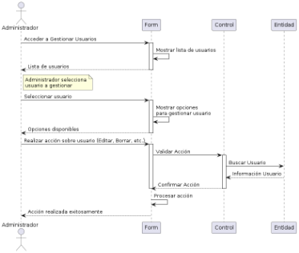

Diagrama de Secuencia para Gestionar Monedas

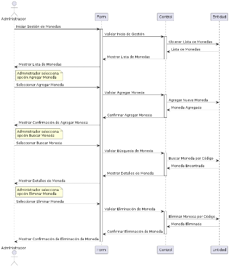

Diagrama de Secuencia para Gestionar Tasas de Cambio

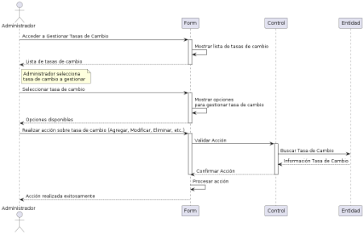

Diagrama de Secuencia para Cliente realizando una conversión

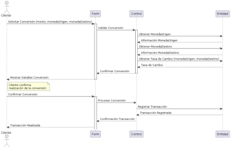

Diagrama de Secuencia: Cliente Realizando un Retiro

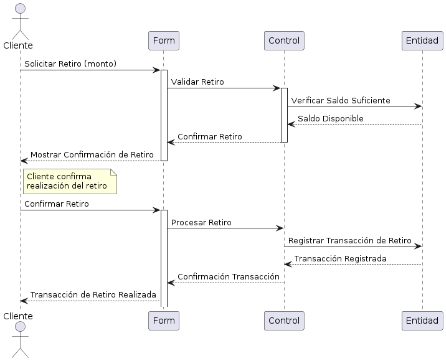

Diagrama de Secuencia: Cliente Consultando su Historial de Transacciones

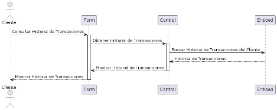

Diagrama de Secuencia: Cliente Consultando Saldo

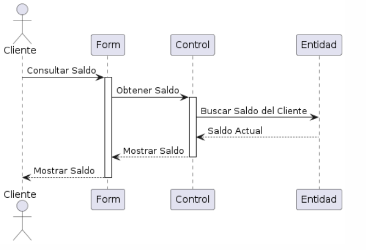

Diagrama de Secuencia: Cliente Realizando un Depósito

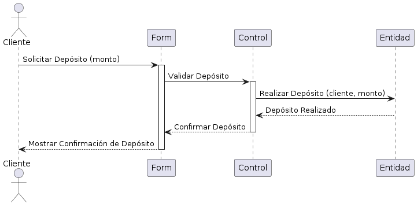

Diagrama de Secuencia: Administrador actualiza Tasa de Cambio

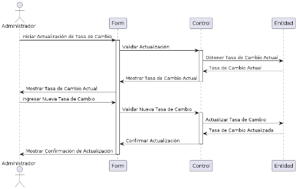
1. ### Diagrama de Objetos

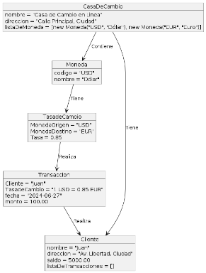
1. ### Diagrama de Clases

1. ### Diagrama de Base de datos (relacional o no relacional)
Modelo Lógico

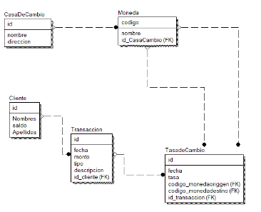

Modelo físico 

1. **Vista de Implementación (vista de desarrollo)**
   1. ### **Diagrama de principios de diseño de API** 

      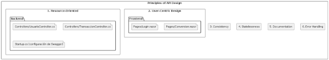

      **Principios de Diseño de API**

      Este proyecto de API sigue varios principios fundamentales para asegurar su eficiencia, usabilidad y mantenibilidad:

      **Resource-Oriented**

      Backend: Utiliza controladores en ASP.NET Core que están orientados a recursos, empleando URLs basadas en métodos HTTP estándar como GET, POST, PUT y DELETE.

      Archivos: Los controladores relevantes para esta arquitectura son UsuarioController.cs y TransaccionController.cs.

      **User-Centric Design**

      Backend: Diseñado para ser intuitivo y fácil de usar para los desarrolladores, facilitando la implementación y la interacción con la API.

      Frontend: La interfaz de usuario (UI) en el frontend está igualmente diseñada para ser intuitiva y accesible.

      Archivos: Se manejan en el backend a través de UsuarioController.cs y TransaccionController.cs, y en el frontend con Login.razor y Conversion.razor.

      **Consistency**

      Backend: Mantiene consistencia en los patrones y convenciones de nombres en los endpoints de la API, asegurando una experiencia coherente para los desarrolladores consumidores.

      Archivos: Los mismos controladores UsuarioController.cs y TransaccionController.cs aplican y mantienen estos estándares.

      **Documentation**

      Backend: Utiliza herramientas como Swagger para documentar exhaustivamente la API, asegurando que los endpoints y sus funcionalidades estén claramente definidos y descritos.

      Archivos: La configuración específica de Swagger se gestiona en Startup.cs.

      **Error Handling**

      Backend: Implementa mensajes de error significativos y utiliza códigos de estado HTTP apropiados para comunicar errores de manera efectiva a los consumidores de la API.

      Archivos: Los controladores UsuarioController.cs y TransaccionController.cs son responsables de manejar adecuadamente el manejo de errores.
   1. ### Diagrama de arquitectura software (paquetes)

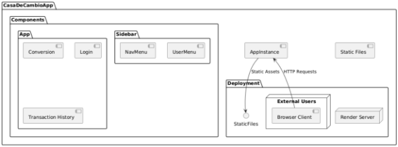
### **Descripción del Diagrama de Arquitectura de Software**
1. **Paquetes**:
   1. **Casa de Cambio en Línea**: El contenedor principal de la aplicación.
   1. **Capa de Vista**: Representa la capa de presentación o interfaz de usuario.
   1. **Capa de Modelo**: Representa la capa de datos, incluyendo modelos y lógica de negocio.
   1. **Capa de Controlador**: Representa la capa de lógica de control, que maneja las solicitudes de la vista y actúa sobre el modelo.
   1. **Servicios API**: Contiene los servicios API expuestos, como Swagger UI y Conversion API.
1. **Relaciones**:
   1. **Capa de Vista a Capa de Controlador**: La capa de vista envía solicitudes a la capa de controlador para manejar la interacción del usuario.
   1. **Capa de Controlador a Capa de Modelo**: La capa de controlador accede a la capa de modelo para consultar o actualizar datos.
   1. **Servicios API a Capa de Controlador**: Los servicios API exponen los endpoints que son manejados por la capa de controlador.
      1. ### Diagrama de arquitectura del sistema (Diagrama de componentes)

         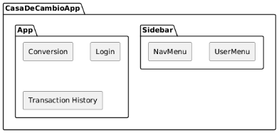

         Componentes Principales:

- **CasaDeCambioApp:** Representa la aplicación principal de Blazor.
- **App:** Es el componente principal que engloba todos los otros componentes de la aplicación.
- **Conversion:** Componente responsable de la conversión de monedas.
- **Login:** Componente encargado del proceso de inicio de sesión de usuarios.
- **Transaction History:** Componente que muestra el historial de transacciones de los usuarios.
- **Sidebar:** Componente que contiene los menús de navegación y opciones.
- **NavMenu:** Menú de navegación principal.
- **UserMenu:** Menú para gestionar la cuenta de usuario.

1. Vista de Despliegue (vista física)
   1. ### Diagrama de despliegue

`	`*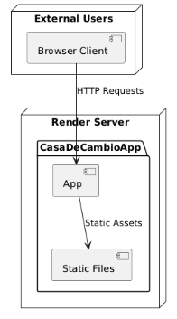*

En este diagrama:

- **Render Server:** Representa el servidor Render donde se despliega y ejecuta tu aplicación CasaDeCambioApp.
- CasaDeCambioApp:
  - AppInstance: Instancia de tu aplicación CasaDeCambioApp desplegada en el servidor Render.
  - StaticFiles: Archivos estáticos como CSS, imágenes y otros recursos necesarios para la interfaz de usuario, servidos directamente desde el servidor Render.
- External Users:
  - Browser Client: Usuarios que acceden a tu aplicación a través de un navegador web, interactuando mediante solicitudes HTTP.
1. # **ATRIBUTOS DE CALIDAD DEL SOFTWARE**

### **Escenario de Funcionalidad**
1. **Fuente:** Usuario final (cliente o administrador)
1. **Estímulo:** Solicitud de una operación (conversión de moneda, gestión de usuario, etc.)
1. **Entorno:** Explotación
1. **Artefacto:** Sistema Casa de Cambio en Línea, servidor y base de datos
1. **Respuesta:** El sistema procesa la solicitud y realiza la operación de manera segura y precisa.
1. **Medida de la Respuesta:** Operación completada con éxito, tiempo de procesamiento, y exactitud de los resultados.
1. **Atributo de calidad afectado:** Funcionalidad
### **Escenario de Usabilidad**
1. **Fuente:** Usuario final (cliente o administrador)
1. **Estímulo:** Interacción con la interfaz del sistema
1. **Entorno:** Explotación
1. **Artefacto:** Sistema Casa de Cambio en Línea, servidor y base de datos
1. **Respuesta:** El usuario puede navegar y utilizar el sistema de manera intuitiva y eficiente.
1. **Medida de la Respuesta:** Tasa de éxito en la primera tarea, tiempo para aprender a usar el sistema, tasa de errores del usuario, y satisfacción del usuario.
1. **Atributo de calidad afectado:** Usabilidad
### **Escenario de Confiabilidad**
1. **Fuente:** Usuario final o administrador
1. **Estímulo:** Acceso a datos o transacciones
1. **Entorno:** Explotación
1. **Artefacto:** Sistema Casa de Cambio en Línea, servidor y base de datos
1. **Respuesta:** El sistema mantiene la confidencialidad, integridad y disponibilidad de los datos.
1. **Medida de la Respuesta:** Número de fallos de seguridad, tiempo de recuperación después de una falla, y porcentaje de tiempo de actividad del sistema.
1. **Atributo de calidad afectado:** Confiabilidad
### **Escenario de Rendimiento**
1. **Fuente:** Usuario final o administrador
1. **Estímulo:** Realización de múltiples operaciones simultáneamente
1. **Entorno:** Explotación
1. **Artefacto:** Sistema Casa de Cambio en Línea, servidor y base de datos
1. **Respuesta:** El sistema responde rápidamente y procesa las operaciones eficientemente.
1. **Medida de la Respuesta:** Tiempo de respuesta, tiempo de procesamiento y uso de recursos (CPU, memoria).
1. **Atributo de calidad afectado:** Rendimiento
### **Escenario de Mantenibilidad**
1. **Fuente:** Equipo de desarrollo o administrador del sistema
1. **Estímulo:** Necesidad de actualizar o modificar el sistema
1. **Entorno:** Explotación
1. **Artefacto:** Sistema Casa de Cambio en Línea, servidor y base de datos
1. **Respuesta:** El sistema puede ser actualizado y modificado fácilmente sin afectar su funcionamiento.
1. **Medida de la Respuesta:** Tiempo requerido para implementar cambios, facilidad de actualización y extensión del sistema.
1. **Atributo de calidad afectado:** Mantenibilidad
### **Escenario de Performance**
1. **Fuente:** Usuario final o administrador
1. **Estímulo:** Alta demanda de operaciones (picos de tráfico)
1. **Entorno:** Explotación
1. **Artefacto:** Sistema Casa de Cambio en Línea, servidor y base de datos
1. **Respuesta:** El sistema maneja eficientemente la alta carga de operaciones y mantiene un rendimiento óptimo.
1. **Medida de la Respuesta:** Número de transacciones procesadas por segundo, tiempo de respuesta bajo carga, y utilización de recursos.
1. **Atributo de calidad afectado:** Performance

