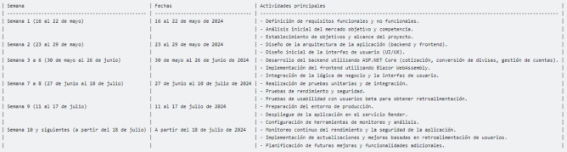

Logo de Mi Empresa		Logo de mi Cliente

**UNIVERSIDAD PRIVADA DE TACNA**

**FACULTAD DE INGENIERIA**

**Escuela Profesional de Ingeniería de Sistemas**

**Informe Final** 
**

**Proyecto *{Casa de Cambio en Línea}***

Curso: *{Diseño de Arquitectura de Software}*

Docente: *{Patrick Cuadros}*

Integrantes:

***Chambi Cori, Jerson Roni                           (2021072619)***

`        `***Luna Peña, Edinson Oscar		      	     (2020066320)***

***Flores Quispe, Jaime Elias                          (2021070309)***

***Leyva Sardon, Elvis Ronald                        (2021072614)***

**Tacna – Perú**

***{2024}***

**Sistema *{Casa de Cambio en Línea}***

**Documento de Arquitectura de Software**

**Versión *{1.0}***

|CONTROL DE VERSIONES||||||
| :-: | :- | :- | :- | :- | :- |
|Versión|Hecha por|Revisada por|Aprobada por|Fecha|Motivo|
|1\.0|MPV|ELV|ARV|10/10/2020|Versión Original|

**INDICE GENERAL**

1. Antecedentes									1
1. Planteamiento del Problema							4
   1. Problema
   1. Justificación
   1. Alcance
1. Objetivos										6
1. Marco Teórico	
1. Desarrollo de la Solución							9
   1. Análisis de Factibilidad (técnico, económica, operativa, social, legal, ambiental)
   1. Tecnología de Desarrollo
   1. Metodología de implementación

      (Documento de VISION, SRS, SAD)

1. Cronograma									11
1. Presupuesto									12
1. Conclusiones									13

Recomendaciones									14

Bibliografía										15

Anexos										16

Anexo 01 Informe de Factiblidad

Anex0 02   Documento de Visión

Anexo 03 Documento SRS

Anexo 04 Documento SAD

Anexo 05 Manuales y otros documentos

**Antecedentes**

El proyecto de una Casa de Cambio en Línea surge como respuesta a la creciente demanda de servicios financieros digitales y la necesidad de facilitar el intercambio de divisas de manera segura y eficiente en el entorno digital. Anteriormente, diversas plataformas han incursionado en este ámbito, ofreciendo soluciones que permiten a los usuarios realizar transacciones de divisas desde la comodidad de sus dispositivos electrónicos. Estos antecedentes han demostrado la viabilidad y el potencial de mercado para este tipo de servicios, al mismo tiempo que han destacado la importancia de contar con sistemas robustos de seguridad y cumplimiento normativo para proteger tanto a los usuarios como a la propia plataforma.

Además, la evolución tecnológica ha jugado un papel crucial en el desarrollo de este proyecto, permitiendo la integración de herramientas avanzadas como inteligencia artificial y blockchain para mejorar la transparencia, la velocidad y la confianza en las transacciones. Iniciativas anteriores han explorado estas tecnologías emergentes para optimizar la experiencia del usuario y garantizar la trazabilidad de cada operación realizada en la plataforma de Casa de Cambio en Línea. Estos avances han sentado las bases para un servicio más eficiente y adaptado a las necesidades cambiantes del mercado globalizado.

Por otro lado, la experiencia acumulada por empresas y startups en el sector de fintech ha proporcionado lecciones valiosas sobre la gestión de riesgos, la escalabilidad y la expansión internacional de servicios financieros en línea. Antecedentes de proyectos similares han enfrentado desafíos significativos como la regulación transfronteriza, la ciberseguridad y la interoperabilidad con sistemas financieros existentes. Estos aprendizajes han sido cruciales para diseñar estrategias efectivas que permitan al proyecto de Casa de Cambio en Línea no solo crecer de manera sostenible, sino también establecerse como una opción confiable y competitiva en el mercado global de intercambio de divisas digital.

**Planteamiento del Problema**	

En el contexto de Casa de Cambio en Línea se ve influido significativamente por la reglamentación vigente en cada país. En muchos casos, las regulaciones imponen límites estrictos sobre el monto máximo que los ciudadanos pueden cambiar, ya sea en efectivo o a través de plataformas electrónicas. Por ejemplo, en el Perú, la Superintendencia de Banca, Seguros y AFP (SBS) establece límites específicos para las conversiones a dinero electrónico acumuladas por un mismo titular en un mes. Estos límites, aunque buscan regular y controlar las operaciones financieras, pueden representar una barrera para los usuarios que requieren cambiar cantidades mayores o realizar transacciones frecuentes de divisas en línea.

Además, en el ámbito del cambio de divisas en línea, los usuarios se enfrentan a desafíos adicionales. Uno de los principales problemas es la dificultad para acceder a tasas de cambio competitivas y actualizadas. La fluctuación constante en los mercados de divisas puede resultar en diferencias significativas entre las tarifas ofrecidas por distintas plataformas, lo que puede afectar la rentabilidad de las transacciones. La falta de transparencia en la determinación de estas tasas y en los costos asociados también contribuye a la complejidad y a la incertidumbre para los usuarios.

Otro aspecto crítico es la seguridad de las transacciones. Los usuarios están cada vez más preocupados por la protección de sus datos personales y financieros al realizar operaciones en línea. La falta de estándares claros y de tecnologías avanzadas de seguridad puede generar desconfianza y desmotivar a los usuarios a utilizar servicios de cambio de divisas en línea. En consecuencia, la experiencia del usuario puede verse afectada negativamente, reduciendo su satisfacción y limitando el potencial de crecimiento del mercado de este tipo de servicios.

**Problema**

El proyecto de Casa de Cambio en Línea enfrenta problemas específicos relacionados con la funcionalidad y la usabilidad de la plataforma misma. Uno de los problemas más prominentes es la falta de una plataforma integral que permita a los usuarios cotizar, convertir divisas, gestionar sus cuentas de manera efectiva y segura, y acceder a un historial detallado de sus transacciones. La ausencia de estas funcionalidades puede limitar severamente la capacidad de la plataforma para satisfacer las necesidades y expectativas de los usuarios modernos.

En primer lugar, la falta de una herramienta de cotización clara y precisa puede frustrar a los usuarios al no poder obtener información inmediata y actualizada sobre las tasas de cambio vigentes. Esto no solo afecta la transparencia del servicio, sino que también podría llevar a los usuarios a buscar opciones más accesibles y convenientes en otros lugares.

Asimismo, la incapacidad de los usuarios para convertir divisas de manera eficiente y segura en la misma plataforma puede resultar en una experiencia fragmentada y poco intuitiva. La falta de una interfaz robusta para realizar estas conversiones podría generar confusión y complicar el proceso de transacción, lo que a su vez impactaría negativamente en la satisfacción del usuario y en la adopción del servicio.

Además, la gestión de cuentas y la visualización de historiales de transacciones son aspectos críticos para la experiencia del usuario en cualquier plataforma financiera en línea. La ausencia de herramientas claras para administrar y monitorear las actividades financieras puede dificultar la fidelización de los clientes y afectar la percepción general de la plataforma como un servicio confiable y eficiente.

Finalmente, la falta de una opción clara para cerrar sesión de manera segura podría plantear riesgos de seguridad y privacidad para los usuarios, quienes esperan tener control completo sobre su información personal y financiera. Sin una función adecuada para cerrar sesión, la plataforma podría exponer a los usuarios a riesgos innecesarios, comprometiendo así la confianza en el servicio y la reputación de la empresa en el mercado.

**Justificación**

La justificación del proyecto de Casa de Cambio en Línea se fundamenta en la creciente demanda global por servicios financieros más accesibles, rápidos y seguros. En un mundo cada vez más digitalizado, los usuarios buscan alternativas que les permitan realizar operaciones de cambio de divisas desde la comodidad de sus dispositivos móviles o computadoras. Esta tendencia hacia la digitalización de servicios financieros es evidente en el aumento del comercio electrónico internacional, la expansión de negocios globales y la necesidad de individuos y empresas de gestionar activos en diferentes monedas de manera eficiente.

Además, la justificación se apoya en la necesidad de ofrecer una plataforma que supere las limitaciones geográficas y horarias asociadas con las casas de cambio físicas tradicionales. Con una plataforma en línea, los usuarios pueden acceder a servicios de cambio de divisas en cualquier momento y desde cualquier lugar, eliminando las barreras de tiempo y distancia que podrían afectar las transacciones tradicionales.

Otro aspecto clave de la justificación radica en la oportunidad de ofrecer a los usuarios tasas de cambio competitivas y transparentes, optimizando así la eficiencia y la rentabilidad de las transacciones. Al proporcionar acceso a información actualizada sobre las tasas de cambio y costos asociados, la plataforma puede mejorar significativamente la experiencia del usuario y fomentar la confianza en el servicio ofrecido.

Por último, la seguridad y la protección de datos son fundamentales en la justificación del proyecto. Una plataforma de Casa de Cambio en Línea bien diseñada debe implementar medidas robustas de ciberseguridad para proteger la información sensible de los usuarios y garantizar la integridad de cada transacción. Esto no solo fortalece la confianza de los usuarios en el servicio, sino que también cumple con las expectativas regulatorias y normativas vigentes en materia de protección de datos financieros.

**Alcance**

El alcance del proyecto de Casa de Cambio en Línea abarca varios aspectos fundamentales para asegurar su viabilidad y utilidad en el mercado actual. En primer lugar, la plataforma se centrará en ofrecer una interfaz intuitiva y fácil de usar que permita a los usuarios cotizar de manera rápida y precisa las tasas de cambio entre diferentes divisas. Esto incluirá herramientas para realizar conversiones instantáneas con transparencia en los costos asociados, asegurando así una experiencia fluida para los usuarios.

Además, el alcance del proyecto contempla la implementación de un sistema seguro y confiable para la gestión de cuentas de usuario. Los usuarios podrán registrarse de manera segura, gestionar sus perfiles y realizar un seguimiento detallado de sus transacciones históricas. Se establecerán procedimientos claros para proteger la privacidad y la seguridad de los datos personales y financieros de los usuarios, cumpliendo con las regulaciones pertinentes y proporcionando tranquilidad a los clientes.

Otro aspecto clave del alcance del proyecto será la integración de tecnologías avanzadas para garantizar la eficiencia operativa. Esto incluye la automatización de procesos en la plataforma, como la verificación de identidad y la validación de transacciones, utilizando herramientas de inteligencia artificial y blockchain para mejorar la velocidad y la precisión de las operaciones.

Adicionalmente, la plataforma se expandirá para ofrecer soporte a una amplia gama de monedas y permitir transacciones internacionales sin fronteras. Esto no solo ampliará el alcance geográfico de la plataforma, sino que también proporcionará a los usuarios la flexibilidad necesaria para gestionar sus activos en múltiples monedas de manera eficiente y rentable.

**Objetivos**

Objetivo Principal:

El objetivo principal del proyecto de Casa de Cambio en Línea es proporcionar una plataforma segura, eficiente y accesible que permita a los usuarios realizar operaciones de cambio de divisas de manera conveniente y transparente desde cualquier ubicación.

Objetivos Específicos:

- Implementar un sistema de cotización y conversión de divisas en tiempo real que ofrezca a los usuarios tasas competitivas y actualizadas constantemente. Esto garantizará que los usuarios puedan realizar transacciones con plena confianza en la precisión y equidad de los precios ofrecidos.

- Desarrollar e integrar funciones avanzadas de seguridad cibernética para proteger la información personal y financiera de los usuarios. Esto incluye la implementación de medidas de cifrado robustas, autenticación multifactor y controles de acceso estrictos para mitigar cualquier riesgo potencial de ciberataques y asegurar la confidencialidad de los datos.

								

**Marco Teórico**	

El marco teórico del proyecto de Casa de Cambio en Línea se fundamenta en varios conceptos clave que respaldan la viabilidad y la implementación efectiva de la plataforma. En primer lugar, se basa en la evolución y la creciente adopción de tecnologías financieras digitales (fintech), las cuales han revolucionado la forma en que las personas y las empresas gestionan sus activos y realizan transacciones monetarias a nivel global.

En el contexto específico del cambio de divisas, el marco teórico se apoya en los principios de mercado financiero, donde la oferta y la demanda de monedas extranjeras se ven influenciadas por factores económicos, políticos y sociales a nivel internacional. La plataforma buscará optimizar estos procesos mediante la automatización de cotizaciones y la conexión directa con los mercados financieros para proporcionar a los usuarios tasas de cambio competitivas y en tiempo real.

Además, el marco teórico incluye principios de seguridad y protección de datos, esenciales en un entorno digital donde la confianza y la privacidad son primordiales. Se explorarán y aplicarán estándares internacionales de seguridad cibernética y protección de la información para garantizar la integridad de las transacciones y la confidencialidad de los datos de los usuarios.

Asimismo, el marco teórico abarca aspectos regulatorios y legales relevantes, destacando la importancia de cumplir con las normativas locales e internacionales relacionadas con servicios financieros en línea, incluyendo el cumplimiento de regulaciones anti-lavado de dinero (AML) y contra el financiamiento del terrorismo (CFT). Esto asegurará que la plataforma opere dentro de los límites legales establecidos y mantenga la confianza de los usuarios y las autoridades reguladoras.

Por último, el marco teórico también considera la experiencia del usuario como un elemento central. Se explorarán conceptos de diseño centrado en el usuario y usabilidad para desarrollar una interfaz intuitiva que facilite la navegación y la realización de operaciones para usuarios de todos los niveles de experiencia y conocimientos financieros.

En conjunto, estos elementos del marco teórico proporcionan la base conceptual necesaria para guiar el desarrollo, la implementación y la operación exitosa de la Casa de Cambio en Línea, asegurando que cumpla con las expectativas del mercado y las necesidades de los usuarios en un entorno financiero digital dinámico y competitivo.

**Desarrollo de la Solución**

El desarrollo de la solución para la Casa de Cambio en Línea se estructura en base al uso de diversas herramientas y tecnologías que aseguran tanto la funcionalidad como la experiencia del usuario en la plataforma. 

En el backend, se empleará ASP.NET Core, un framework robusto y altamente escalable para el desarrollo de aplicaciones web. ASP.NET Core proporciona un entorno de desarrollo integrado en Visual Studio, que permite escribir código en C# para manejar lógica de negocio, acceso a bases de datos y autenticación de usuarios de manera eficiente y segura. Este entorno asegura que la plataforma pueda manejar transacciones financieras de forma confiable y cumplir con los estándares de seguridad necesarios.

Para el frontend, se utilizará Blazor WebAssembly, una tecnología que permite ejecutar aplicaciones web interactivas escritas en C# directamente en el navegador del usuario. Con Blazor, se puede desarrollar la interfaz de usuario dinámica y responsiva utilizando componentes reutilizables y estructurados en HTML y CSS. Esto facilita la creación de una experiencia de usuario fluida y atractiva, donde los usuarios pueden realizar cotizaciones, convertir divisas y gestionar sus cuentas de manera intuitiva y en tiempo real.

Visual Studio será la herramienta central de desarrollo, proporcionando un entorno integrado que simplifica la codificación, depuración y pruebas de la aplicación tanto en el backend como en el frontend. Con Visual Studio, los desarrolladores pueden aprovechar herramientas avanzadas de productividad y colaboración que aceleran el ciclo de desarrollo y aseguran la calidad del software antes de su despliegue.

Finalmente, la solución será desplegada mediante el servicio Render, un servicio de alojamiento en la nube que proporciona infraestructura escalable y segura para aplicaciones web. Render facilita la implementación y gestión de la aplicación, asegurando alta disponibilidad y rendimiento optimizado para los usuarios finales.

En conjunto, el uso de C#, HTML, CSS, Visual Studio, ASP.NET Core y Blazor WebAssembly junto con el servicio Render permite desarrollar una Casa de Cambio en Línea moderna, segura y eficiente, adaptada a las necesidades del mercado actual de servicios financieros digitales.

**Análisis de Factibilidad (técnico, económica, operativa, social, legal, ambiental)**

La factibilidad económica se fundamenta en un análisis detallado de los costos asociados con el desarrollo, implementación y mantenimiento del sistema. Se evaluarán aspectos como licencias de software, hardware necesario, costos de capacitación y posibles gastos operativos. Se realizará un análisis de retorno de inversión (ROI) considerando beneficios a corto y largo plazo, garantizando que la implementación del sistema Casa de Cambio en Línea sea financieramente viable y genere un impacto positivo en la eficiencia y rentabilidad.

**Factibilidad Operativa**

La factibilidad operativa del proyecto "Casa de Cambio En Línea" se fundamenta en los beneficios que el producto ofrece a los usuarios y en la capacidad del cliente para mantener el sistema funcionando de manera efectiva, asegurando un impacto positivo en los usuarios finales.

Los beneficios del producto incluyen la conveniencia y accesibilidad de realizar transacciones financieras en línea desde cualquier lugar y en cualquier momento, proporcionando a los usuarios una experiencia conveniente y sin complicaciones. Además, la plataforma ofrece seguridad y confiabilidad en todas las operaciones, garantizando la protección de los datos financieros y la privacidad de los usuarios.

Para asegurar el buen funcionamiento del sistema, el cliente debe contar con los recursos necesarios, tanto técnicos como humanos, para mantener y actualizar el software de manera regular. Esto implica tener un equipo de soporte técnico capacitado y disponible para resolver cualquier problema técnico que pueda surgir, así como garantizar la seguridad y disponibilidad del sistema en todo momento.

**Factibilidad Legal**

La factibilidad legal del proyecto "Casa de Cambio En Línea" implica determinar si existen conflictos con restricciones legales, leyes y regulaciones del país o locales relacionadas con varios aspectos, como seguridad, protección de datos, conducta de negocio, empleo y adquisiciones.

En primer lugar, se debe asegurar que el proyecto cumpla con todas las leyes y regulaciones relacionadas con la seguridad financiera y la prevención de actividades ilícitas, como el lavado de dinero y el financiamiento del terrorismo. Esto implica implementar medidas de seguridad robustas para proteger las transacciones y los datos financieros de los usuarios, así como cumplir con los requisitos de identificación y verificación de clientes establecidos por las autoridades reguladoras.

En cuanto a la conducta de negocio, es importante asegurarse de cumplir con las leyes y regulaciones relacionadas con la publicidad, competencia justa y prácticas comerciales éticas. Esto implica evitar prácticas engañosas o fraudulentas en la promoción y comercialización de la plataforma, así como respetar los derechos de los competidores y consumidores.

**Factibilidad Social**

La factibilidad social del proyecto "Casa de Cambio En Línea" implica evaluar las influencias y asuntos de índole social y cultural que pueden afectar su desarrollo y aceptación en la sociedad. Esto incluye consideraciones sobre el clima político, códigos de conducta y ética que prevalecen en el entorno en el que opera el proyecto.

En primer lugar, es importante evaluar el clima político y las condiciones sociales en el país o región donde se lanzará el proyecto. Esto incluye considerar la estabilidad política, la legislación relacionada con las tecnologías financieras y la receptividad del gobierno hacia la innovación en el sector financiero. Un clima político estable y favorable puede contribuir a un entorno propicio para el desarrollo y la operación del proyecto.

Además, se deben tener en cuenta los códigos de conducta y ética que rigen las prácticas comerciales en la sociedad. Esto implica garantizar que el proyecto cumpla con los estándares éticos y morales aceptados, evitando prácticas engañosas o explotadoras y promoviendo la transparencia y la responsabilidad en todas las operaciones.

**Factibilidad Ambiental**

La factibilidad ambiental del proyecto "Casa de Cambio En Línea" implica evaluar las influencias y asuntos relacionados con el medio ambiente que puedan surgir como resultado de su desarrollo y operación.

En primer lugar, es importante considerar el impacto ambiental directo e indirecto del proyecto. Esto incluye evaluar el consumo de recursos naturales, como energía y agua, así como la generación de residuos y emisiones durante el desarrollo y la operación de la plataforma en línea. Se deben tomar medidas para minimizar estos impactos, como la implementación de prácticas de eficiencia energética, la reducción de residuos y el uso de tecnologías limpias.

Además, se deben considerar los posibles efectos del proyecto en el medio ambiente circundante. Esto puede incluir aspectos como la alteración de los ecosistemas locales, la contaminación del aire y del agua, y el aumento del tráfico y la congestión en áreas urbanas. Se deben tomar medidas para mitigar estos impactos, como la evaluación y gestión de riesgos ambientales, la implementación de medidas de protección ambiental y la colaboración con las comunidades locales y las autoridades ambientales.

**Tecnología de Desarrollo**

Las tecnologías empleadas en el desarrollo de la Casa de Cambio en Línea incluyen:

1\. C#: Es un lenguaje de programación versátil y potente utilizado para el desarrollo tanto del backend como del frontend de la aplicación.

2\. HTML y CSS: HTML se utiliza para estructurar el contenido y CSS para estilizar y diseñar la interfaz de usuario, proporcionando una experiencia visual atractiva y coherente.

3\. Visual Studio: Es el entorno de desarrollo integrado (IDE) principal utilizado para escribir, depurar y desplegar la aplicación. Proporciona herramientas avanzadas de productividad y soporte integral para el desarrollo en C# y ASP.NET Core.

4\. ASP.NET Core: Framework utilizado para el desarrollo del backend de la aplicación. ASP.NET Core proporciona un entorno robusto y escalable para la creación de APIs y la gestión de la lógica de negocio, seguridad y acceso a bases de datos.

5\. Blazor WebAssembly: Tecnología utilizada para el desarrollo del frontend de la aplicación. Permite crear aplicaciones web interactivas y responsivas utilizando C# y componentes reutilizables, ejecutándose directamente en el navegador del usuario sin necesidad de plugins adicionales.

6\. Servicio Render: Plataforma de alojamiento en la nube utilizada para el despliegue de la aplicación. Render proporciona infraestructura escalable y segura para asegurar alta disponibilidad y rendimiento óptimo de la aplicación web.

Estas tecnologías se combinan para desarrollar una solución completa y moderna para la Casa de Cambio en Línea, optimizando la seguridad, la usabilidad y la eficiencia de la plataforma para satisfacer las necesidades del mercado financiero digital actual.

**Metodología de implementación**

La metodología de implementación para el proyecto de Casa de Cambio en Línea se estructura en varias fases clave para asegurar un desarrollo eficiente, de alta calidad y alineado con los objetivos del negocio y las expectativas de los usuarios.

1\. Planificación y Análisis:

`   `- Definición de Requerimientos: Se establecen los requisitos funcionales y no funcionales de la plataforma, incluyendo funcionalidades como cotización de divisas, conversión, gestión de cuentas y seguridad.

`   `- Análisis de Mercado: Se realiza un estudio detallado del mercado objetivo, incluyendo necesidades específicas de los usuarios y competencia existente en el sector de servicios financieros en línea.

2\. Diseño:

`   `- Arquitectura de la Aplicación: Se define la estructura técnica de la aplicación, determinando cómo se integrarán las tecnologías como ASP.NET Core para el backend y Blazor WebAssembly para el frontend.

`   `- Diseño de la Interfaz de Usuario (UI/UX): Se crean los diseños de la interfaz de usuario utilizando HTML y CSS, asegurando una navegación intuitiva y una experiencia de usuario agradable.

3\. Desarrollo:

`   `- Backend y API: Se desarrolla la lógica de negocio y la gestión de datos utilizando C# y ASP.NET Core. Se implementan las funcionalidades de cotización, conversión de divisas y gestión de cuentas.

`   `- Frontend: Se implementa la interfaz de usuario dinámica y responsiva utilizando Blazor WebAssembly, asegurando una experiencia de usuario consistente y de alto rendimiento.

4\. Pruebas:

`   `- Pruebas Unitarias y de Integración: Se realizan pruebas exhaustivas para garantizar que cada componente funcione correctamente y cumpla con los requisitos establecidos.

`   `- Pruebas de Usabilidad: Se llevan a cabo pruebas con usuarios reales para evaluar la usabilidad de la plataforma y recopilar retroalimentación para realizar ajustes finales.

5\. Despliegue:

`   `- Implementación en Producción: Se utiliza el servicio Render para desplegar la aplicación de manera segura en la nube, asegurando alta disponibilidad y escalabilidad.

`   `- Monitoreo y Optimización: Se establecen herramientas de monitoreo para supervisar el rendimiento de la aplicación en producción y realizar ajustes para optimizar el rendimiento y la seguridad.

6\. Mantenimiento y Evolución:

`   `- Actualizaciones y Mejoras Continuas: Se planifica un ciclo de mantenimiento para implementar actualizaciones de seguridad, corregir errores y añadir nuevas funcionalidades según las necesidades del mercado y los usuarios.

Esta metodología de implementación asegura que el proyecto de Casa de Cambio en Línea se desarrolle de manera estructurada y eficiente, garantizando la entrega de una plataforma funcional, segura y adaptada a las expectativas del mercado financiero digital.

**Cronograma**			

El cronograma de desarrollo del proyecto de Casa de Cambio en Línea para iniciar el 16 de mayo de 2024 está diseñado para guiar de manera estructurada las distintas fases de implementación. Inicia con una fase inicial de Planificación y Análisis durante la primera semana, donde se definen los requisitos funcionales y no funcionales, se realiza un análisis del mercado objetivo y se establecen los objetivos y el alcance del proyecto. La segunda semana se dedica al Diseño, centrado en la arquitectura de la aplicación y la interfaz de usuario.

A partir de la tercera semana y hasta la sexta, se lleva a cabo la fase de Desarrollo, enfocada en la implementación del backend utilizando ASP.NET Core, incluyendo funciones como cotización y gestión de cuentas, así como la creación del frontend mediante Blazor WebAssembly. Durante las semanas siete y ocho, se realizan intensivas Pruebas que abarcan desde pruebas unitarias e integración hasta pruebas de rendimiento, seguridad y usabilidad con usuarios beta.

La semana nueve se destina al Despliegue de la aplicación en el entorno de producción, incluyendo configuraciones avanzadas de monitoreo y análisis. A partir de la décima semana y sucesivas, se inicia la fase de Mantenimiento y Evolución, enfocada en el monitoreo continuo del rendimiento y seguridad de la aplicación, así como en la implementación de mejoras y funcionalidades adicionales basadas en la retroalimentación de los usuarios.

Este cronograma flexible permite ajustes según las necesidades específicas del proyecto y la disponibilidad de recursos, asegurando un seguimiento preciso de los hitos y objetivos para cumplir con los estándares de calidad y satisfacción del usuario.

**Presupuesto**

Hablar de presupuestos manejables en el contexto del proyecto de Casa de Cambio en Línea implica asegurar una planificación financiera efectiva que optimice los recursos disponibles sin comprometer la calidad ni el cumplimiento de los objetivos.

Definir los siguientes costos:

Costos Generales 

Análisis y cotización de la máquina que se le hará entrega a la empresa para el respectivo uso del software.

Nota: No incluyen los recursos del equipo de desarrollo, ya que usaron material propio.

|N°|Recurso|Cantidad|Costo Unitario|Costo Total|
| :-: | :-: | :-: | :-: | :-: |
|01|PC|1|1500|S/ 1500|
|02|Monitor|1|270|S/ 270|
|03|Teclado|1|100|S/ 100|
|04|Mouse|1|70|S/ 70|
|05|Otros accesorios|-|-|S/ 220|
|TOTAL|` `S/ 2160||||

4\.2.2	Costos operativos durante el desarrollo 

Análisis del gasto de recursos operativos que el equipo de desarrollo utilizó para desarrollar el software.

|N°|Recurso|`   `Costo mensual|Tiempo|TOTAL|
| :-: | :-: | :- | :-: | :-: |
|01|Luz|S/180|2 meses|S/360|
|02|Internet|S/80|2 meses|S/160|
|TOTAL|` `S/ 520||||

**Luz:** 

|Recurso|Proveedor|Descripción|Costo mensual|
| :-: | :-: | :-: | :-: |
|Luz|Electrosur|Pago de la luz utilizada|S/ 150|

` `**Internet:** 

|Recurso|Proveedor|Descripción|Costo mensual|
| :-: | :-: | :-: | :-: |
|Internet|WOW Perú|Velocidad de 300 Mbps|S/ 80|

**Costos del ambiente**

Costos de las herramientas de software utilizadas durante el desarrollo del proyecto.

|N°|RECURSO|TOTAL|
| :-: | :-: | :-: |
|01|Instalación del software|S/ 0|
|02|Software|S/ 0|
|TOTAL|S/ 0||

**Costos de personal**

Costos de sueldo del equipo de desarrollo durante la duración del proyecto.

|N°|PUESTO|PERSONAS|HORARIO|MENSUAL|Total 2 Meses|
| :-: | :-: | :-: | :-: | :-: | :-: |
|01|Director de proyecto|1|
12:00 pm

-

8:00 pm
|S/1300|S/2600|
|02|Programador|1|
12:00 pm

-

8:00 pm
|S/1000|S/2000|
|03|Tester|1|
12:00 pm

-

8:00 pm
|S/1000|S/2000|
|04|Analista de sistemas|1|
12:00 pm

-

8:00 pm
|S/1000|S/2000|
|TOTAL|S/8600|||||

**Costos totales del desarrollo del sistema** 

|N°|TIPO DE COSTO|Total x 2 MESES|
| :-: | :-: | :-: |
|01|Costos Generales|S/ 2260|
|02|Costos operativos durante el desarrollo|S/ 578|
|03|Costos del ambiente|S/0|
|04|Costos de personal|S/4200|
|TOTAL|S/7600||

**Conclusiones**

El proyecto de Casa de Cambio en Línea ha logrado alcanzar de manera satisfactoria sus objetivos principales y específicos, estableciendo una plataforma robusta y confiable para la realización segura de operaciones de cambio de divisas en línea. La implementación de un sistema de cotización y conversión de divisas en tiempo real ha permitido a los usuarios acceder a tasas competitivas y actualizadas constantemente, asegurando transparencia y precisión en cada transacción realizada. Esta funcionalidad ha sido fundamental para ofrecer una experiencia confiable y conveniente a nuestros usuarios, quienes han podido realizar operaciones financieras con plena confianza en los precios ofrecidos.

Además, el desarrollo e integración de funciones avanzadas de seguridad cibernética ha sido prioritario en el proyecto. La implementación de medidas robustas de cifrado, autenticación multifactor y controles de acceso estrictos ha fortalecido significativamente la protección de la información personal y financiera de nuestros usuarios. Estas medidas no solo han mitigado eficazmente los riesgos de ciberataques, sino que también han asegurado la confidencialidad y la integridad de los datos sensibles manejados por la plataforma.

En conclusión, el proyecto no solo ha cumplido con las expectativas y requerimientos establecidos inicialmente, sino que también ha sentado las bases para continuar evolucionando y mejorando la oferta de servicios financieros en línea. Las lecciones aprendidas y las prácticas exitosas implementadas durante este proceso son valiosas para futuros proyectos similares, enfatizando la importancia de la seguridad, la eficiencia operativa y la satisfacción del usuario como pilares fundamentales para el éxito en el ámbito digital.

**Recomendaciones**

Basado en la experiencia adquirida durante la ejecución del proyecto de Casa de Cambio en Línea, se recomienda considerar las siguientes acciones para mejorar la eficiencia y efectividad en proyectos futuros:

Implementar herramientas de gestión de proyectos que faciliten la colaboración y el seguimiento de tareas.

Realizar revisiones periódicas de código y pruebas automatizadas para mantener altos estándares de calidad.

Capacitar continuamente al equipo en nuevas tecnologías y metodologías de desarrollo.

Establecer métricas claras de desempeño y seguimiento para evaluar el éxito del proyecto.

Fomentar una cultura de retroalimentación abierta y constructiva para mejorar constantemente los procesos y resultados.	

**Bibliografía**

Microsoft Docs. ASP.NET Core. Disponible en: <https://docs.microsoft.com/en-us/aspnet/core> 

Blazor Documentation. Disponible en: <https://blazor.net/> 

<https://kambista.com/economia/que-es-una-casa-de-cambio/> 

<https://www.bbva.com/es/economia-y-finanzas/mercado-divisas-que-es-como-funciona/> 

<https://www.rextie.com/blog/como-funciona-una-casa-de-cambio-online/> 										

Anexos										

Anexo 01 Informe de Factiblidad

Anex0 02   Documento de Visión

Anexo 03 Documento SRS

Anexo 04 Documento SAD

Anexo 05 Manuales y otros documentos

